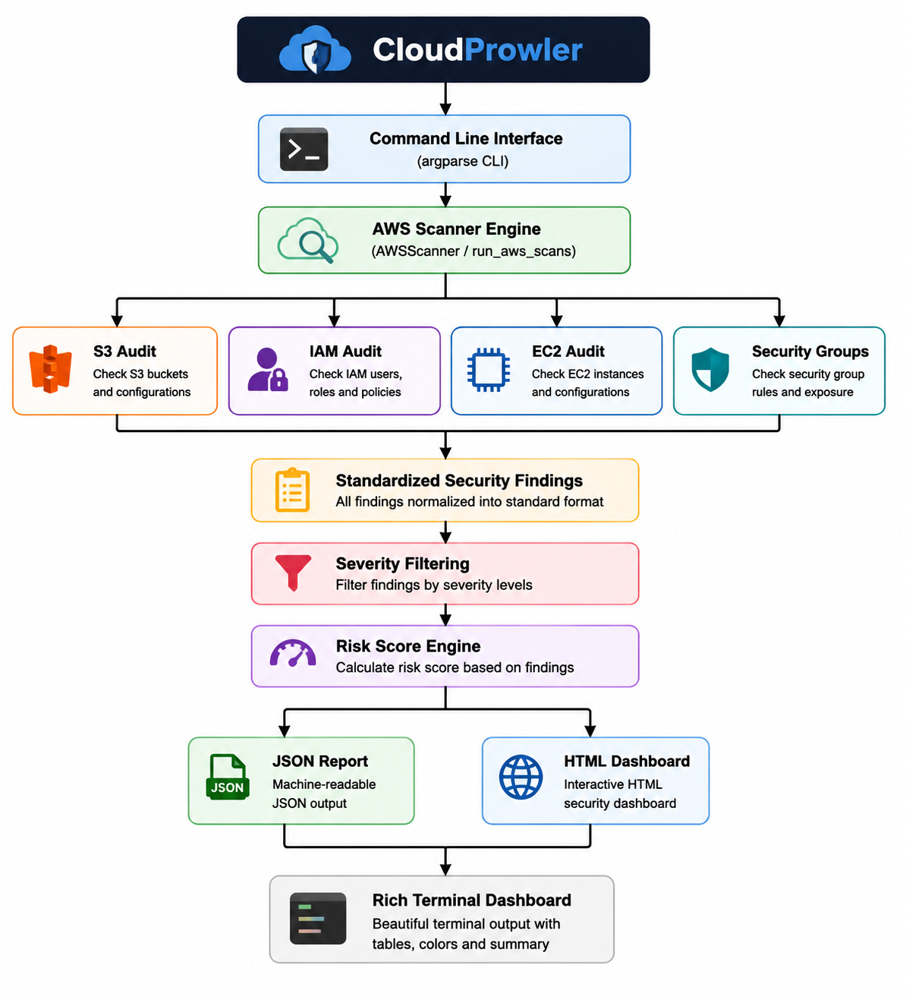
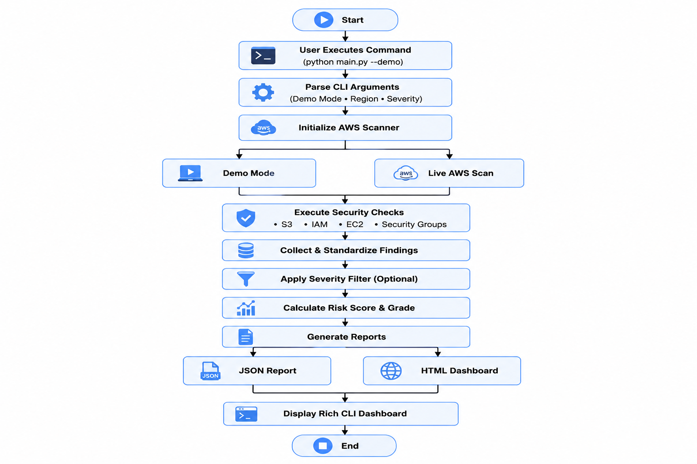
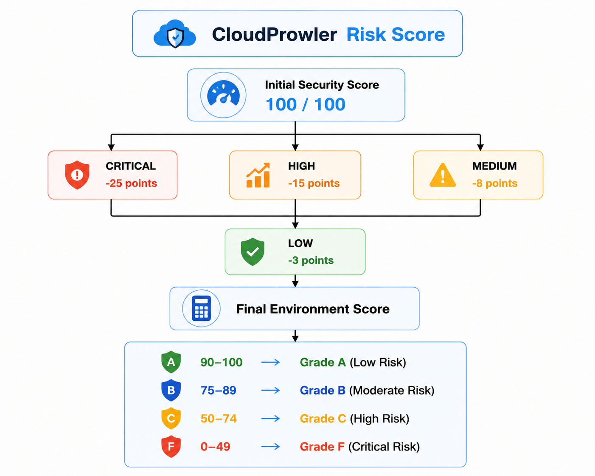
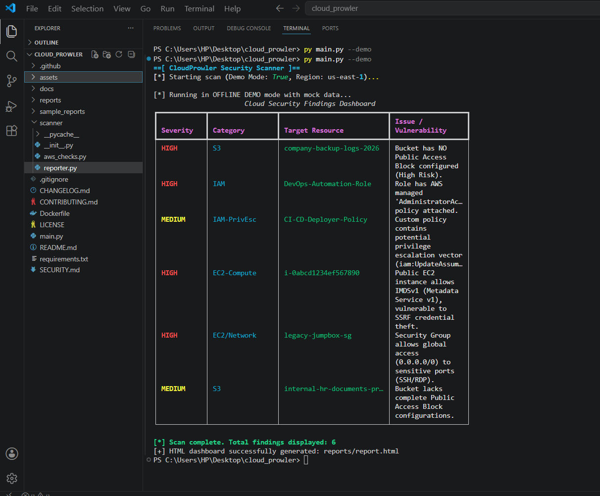
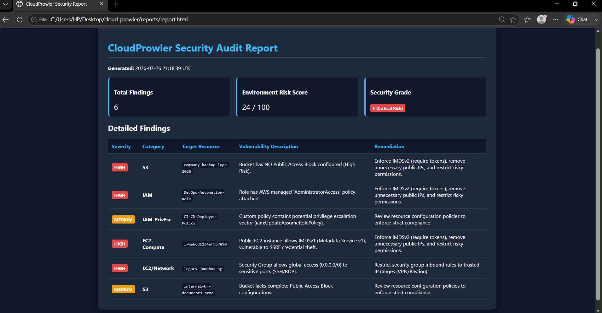
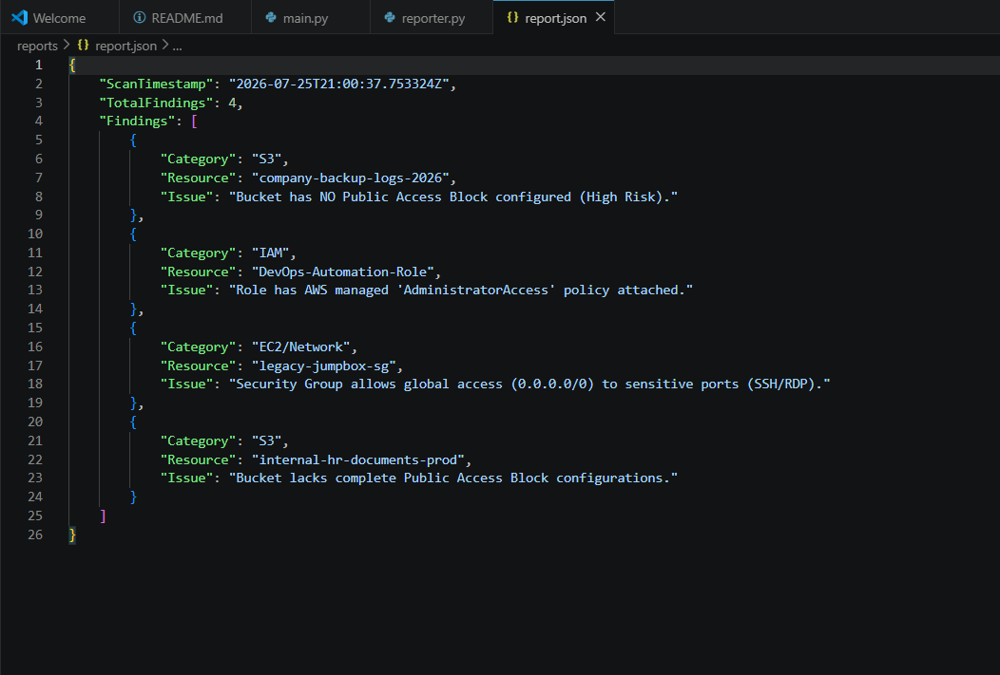

<p align="center">
  
</p>
<p align="center">


</p>

# CloudProwler

Enterprise-Grade AWS Cloud Security & Misconfiguration Auditing Tool

[](https://github.com/DivyanshiKishore/CloudProwler/actions/workflows/python-tests.yml)

CloudProwler is a Python-based cloud security auditing tool designed to identify security misconfigurations, public exposures, and privilege escalation risks across AWS environments. It performs automated security assessments for core AWS services and generates both machine-readable JSON reports and an executive-friendly HTML security dashboard.

Designed with modular architecture and a professional command-line interface, CloudProwler helps security engineers, cloud administrators, and DevSecOps teams quickly identify and prioritize cloud security risks.

---

## ✨ Key Features

- 🔍 Automated AWS security auditing
- 🪣 S3 Public Access Block analysis
- 👤 IAM AdministratorAccess detection
- 🔐 IAM privilege escalation checks
- 💻 EC2 IMDSv1 exposure detection
- 🌐 Security Group exposure analysis
- 📊 Dynamic environment risk scoring
- 📄 HTML security dashboard generation
- 📁 JSON report export
- 🎨 Rich terminal dashboard
- 🧪 Offline Demo Mode
- 🌍 Multi-region scanning support
- 🎯 Severity-based finding filtering

---

# 🚀 Installation

Clone the repository:

```bash
git clone https://github.com/<your-username>/CloudProwler.git
cd CloudProwler
```

Install the required dependencies:

```bash
pip install -r requirements.txt
```

---

# ⚡ Usage

### Run using Offline Demo Mode

```bash
python main.py --demo
```

---

### Scan a Specific AWS Region

```bash
python main.py --region us-east-1
```

---

### Filter Findings by Severity

```bash
python main.py --demo --severity HIGH
```

Supported severity levels:

- CRITICAL
- HIGH
- MEDIUM
- LOW

---

### Generate Reports

JSON Report

```bash
python main.py --output reports/report.json
```

HTML Dashboard

```bash
python main.py --html reports/report.html
```

Generate both

```bash
python main.py --demo --output reports/report.json --html reports/report.html
```
---

# 🏗️ Software Architecture

<p align="center">
  
</p>

CloudProwler follows a modular architecture that separates command-line interaction, cloud security checks, report generation, and visualization into independent components for maintainability and scalability.

---

# 🔄 Workflow

<p align="center">
  
</p>

The workflow illustrates how CloudProwler processes command-line arguments, executes AWS security audits, normalizes findings, calculates the environment risk score, and generates security reports.

---

# 📈 Risk Scoring

<p align="center">
  
</p>

Each finding contributes to an overall environment security score. Higher severity findings reduce the score more significantly, providing a quick overview of the cloud security posture.

---

# 📸 Screenshots

## Rich Terminal Dashboard

<p align="center">
  
</p>

---

## HTML Security Dashboard

<p align="center">
  
</p>

---

## JSON Report

<p align="center">
  
</p>

---

## Project Structure

<p align="center">
  
</p>